# Architecture Documentation

## Table of Contents

- [System Architecture](#system-architecture)
- [Deployment Architecture](#deployment-architecture)
- [Data Flow](#data-flow)
- [Component Details](#component-details)
- [Technology Stack](#technology-stack)
- [Resource Requirements](#resource-requirements)
- [Scaling Considerations](#scaling-considerations)
- [Security](#security)
- [Monitoring & Observability](#monitoring--observability)

## System Architecture

### High-Level Architecture

```mermaid
%%{init: {'theme':'neutral'}}%%
graph TB
    subgraph LocalMachine["Local Machine"]
        Browser["Web Browser<br/>http://localhost:8000"]
        FastAPI["FastAPI UI Server<br/>Port 8000<br/>(runs locally)<br/><br/>Endpoints:<br/>GET / → Render UI<br/>POST /analyze → Sentiment<br/>GET /health → Health"]
    end

    subgraph K8sCluster["Kubernetes Cluster (Minikube)"]
        PortFwd["Port Forward<br/>localhost:8080 → 8000"]
        Seldon["Seldon Model Server<br/>Port 8000<br/><br/>SentimentClassifier<br/>- predict()<br/>- predict_proba()<br/>- health_status()"]

        Pipeline["ML Pipeline<br/>TF-IDF → LogReg"]
        Model["Model File<br/>/mnt/models/<br/>sentiment_model.pkl"]

        Seldon --> Pipeline
        Pipeline -.->|Loads| Model
    end

    Browser -->|HTTP POST| FastAPI
    FastAPI -->|HTTP via port-fwd| PortFwd
    PortFwd -->|Routes to| Seldon
```



## Deployment Architecture

### Kubernetes Deployment (Minikube)


## Data Flow

### Training Pipeline


### Inference Pipeline

```mermaid
%%{init: {'theme':'neutral'}}%%
flowchart TD
    UserInput["User Input<br/>Browser: localhost:8000<br/>Enter text..."]
    FastAPIEndpoint["FastAPI (Local)<br/>POST /analyze<br/><br/>1. Receive text<br/>2. Format Seldon request<br/>3. Call localhost:8080"]
    PortFwd["Port Forward<br/>localhost:8080 → K8s"]
    SeldonServer["Seldon Server (K8s)<br/><br/>1. Receive request<br/>2. Extract ndarray<br/>3. Call predict()"]
    MLPipeline["ML Pipeline<br/><br/>1. TF-IDF vectorize<br/>2. LogReg predict<br/>3. Return label + prob"]
    Response["Seldon Response<br/>{data: {names: ['t:0','t:1'],<br/>ndarray: [['positive', 0.95]]}}"]
    FastAPIResponse["FastAPI renders HTML<br/>with sentiment result"]
    UserSees["Browser displays<br/>😊 Positive (95%)"]

    UserInput -->|HTTP POST| FastAPIEndpoint
    FastAPIEndpoint -->|HTTP| PortFwd
    PortFwd -->|Routes to| SeldonServer
    SeldonServer -->|Calls| MLPipeline
    MLPipeline -->|Returns| Response
    Response -->|JSON| FastAPIEndpoint
    FastAPIEndpoint -->|HTML| UserSees
```



### Training Sequence Diagram

```mermaid
%%{init: {'theme':'neutral'}}%%
sequenceDiagram
    actor User
    participant Make as make train
    participant Script as train_model.py
    participant Data as CSV File
    participant Pipeline as Sklearn Pipeline
    participant Model as sentiment_model.pkl

    User->>Make: make train
    Make->>Script: python src/train_model.py
    Script->>Data: Load data/raw/sentiment_data.csv
    Data-->>Script: 1000 text samples + labels
    Script->>Script: Split train/test (80/20)
    Script->>Pipeline: Create Pipeline<br/>(TF-IDF + LogReg)
    Script->>Pipeline: pipeline.fit(X_train, y_train)
    Pipeline-->>Script: Trained model
    Script->>Script: Evaluate on test set
    Script->>Script: Print accuracy, F1 score
    Script->>Model: joblib.dump(pipeline, path)
    Model-->>Script: Model saved
    Script-->>Make: Training complete
    Make-->>User: ✓ Model trained successfully
```



### Serving Sequence Diagram


## Component Details

### FastAPI Application (Local Only)

**File:** `src/sentiment_app_server.py`

**Runs:** Locally via `make run-ui` (port 8000)

**Responsibilities:**
- Serve web UI to browser
- Handle user sentiment analysis requests
- Connect to Seldon in K8s via port-forward (localhost:8080)
- Format Seldon API requests/responses
- Error handling and display

**Key Functions:**
- `home()` - Render HTML UI
- `analyze_sentiment()` - POST /analyze endpoint
- `call_seldon_api()` - Call Seldon via SELDON_HOST:SELDON_PORT
- `health_check()` - GET /health endpoint

**Environment Variables:**
- `SELDON_HOST` - Default: localhost
- `SELDON_PORT` - Default: 8080 (port-forward target)

### Seldon Model Wrapper

**File:** `src/seldon_model.py`

**Responsibilities:**
- Load trained model
- Implement Seldon interface
- Handle predictions
- Manage model lifecycle

**Key Methods:**
- `load()` - Load model from disk
- `predict()` - Make predictions
- `predict_proba()` - Get probabilities
- `health_status()` - Health check

### Training Script

**File:** `src/train_model.py`

**Responsibilities:**
- Load training data
- Create ML pipeline
- Train model
- Evaluate performance
- Save model

**Pipeline:**
1. TF-IDF Vectorizer
2. Logistic Regression

## Technology Stack

### Development
- **Python:** 3.12.3+
- **Package Manager:** uv
- **Version Manager:** pyenv
- **Notebooks:** Jupyter

### ML Stack
- **Framework:** scikit-learn
- **Data:** pandas, numpy
- **Serialization:** joblib

### Web Stack
- **Framework:** FastAPI
- **Server:** Uvicorn
- **Templates:** Jinja2
- **HTTP Client:** httpx

### Deployment
- **Containers:** Docker
- **Orchestration:** Kubernetes
- **ML Serving:** Seldon Core
- **Local K8s:** Minikube

### DevOps
- **Formatter:** black
- **Linter:** ruff
- **Type Checker:** mypy
- **Testing:** pytest
- **CI/CD:** GitHub Actions

## Resource Requirements

### Local Development
- **CPU:** 2+ cores
- **RAM:** 4+ GB
- **Disk:** 2+ GB

### Minikube Cluster
- **CPU:** 4 cores (recommended)
- **RAM:** 8 GB (recommended)
- **Disk:** 20+ GB

### Container Resources

**Seldon Classifier Container:**
- CPU: 100m request, 500m limit
- Memory: 256Mi request, 512Mi limit
- Defined in: k8s/seldon-deployment.yaml

**Local FastAPI UI:**
- Runs outside cluster (no K8s resources)
- Minimal overhead (~50-100MB RAM)

## Scaling Considerations

### Horizontal Scaling

**Seldon Model Server:**
Edit `k8s/seldon-deployment.yaml`:
```yaml
spec:
  replicas: 3  # Scale to 3 pods
```

Then apply:
```bash
make k8s-deploy-model-server
```

**Note:** FastAPI UI runs locally and is not deployed to K8s, so it doesn't scale horizontally in the cluster.

### Performance

**Expected:**
- Request latency: < 100ms
- Throughput: 100+ req/sec
- Model size: < 10MB

**Optimization:**
- Model caching
- Connection pooling
- Load balancing
- Resource limits

## Security

### Best Practices Implemented
- ✅ Environment variables for config
- ✅ No hardcoded secrets
- ✅ Resource limits set
- ✅ Health checks enabled
- ✅ Non-root containers
- ✅ Read-only file systems (where applicable)

### Future Enhancements
- [ ] Authentication/Authorization
- [ ] Rate limiting
- [ ] TLS/SSL encryption
- [ ] Network policies
- [ ] Secret management
- [ ] RBAC policies

## Monitoring & Observability

### Current Implementation
- Health check endpoints
- Container logs
- Resource metrics

### Recommended Additions
- [ ] Prometheus metrics
- [ ] Grafana dashboards
- [ ] Distributed tracing
- [ ] Log aggregation (ELK stack)
- [ ] Model performance monitoring
- [ ] Alerting (PagerDuty, Slack)

---

**For more details, see:**
- README.md - General documentation
- QUICKSTART.md - Getting started guide
- PROJECT_SUMMARY.md - Project overview
