# Architecture Documentation

## Table of Contents

- [System Architecture](#system-architecture)
- [Deployment Architectures](#deployment-architectures)
- [Data Flow](#data-flow)
- [Component Details](#component-details)
- [Technology Stack](#technology-stack)
- [Resource Requirements](#resource-requirements)
- [Scaling Considerations](#scaling-considerations)
- [Security](#security)
- [Monitoring & Observability](#monitoring--observability)

## System Architecture

### High-Level Architecture


## Deployment Architectures

### Local Development


### Kubernetes Deployment (Minikube)


## Data Flow

### Training Pipeline


### Inference Pipeline

```mermaid
%%{init: {'theme':'neutral'}}%%
flowchart TD
    UserInput["User Input<br/>'Text...'"]
    FastAPIEndpoint["FastAPI Endpoint<br/>POST /analyze<br/><br/>1. Receive text<br/>2. Format request<br/>3. Call Seldon API"]
    SeldonServer["Seldon Model Server<br/><br/>1. Receive request<br/>2. Extract text<br/>3. Call predict()"]
    MLPipeline["ML Pipeline<br/><br/>1. TF-IDF transform<br/>2. Logistic regression<br/>3. Return prediction"]
    Response["Response<br/>{<br/>  'sentiment': 'positive',<br/>  'text': '...'<br/>}"]
    FastAPIResponse["FastAPI Response<br/><br/>Render HTML with result"]
    UserSees["User sees<br/>😊 Positive"]

    UserInput -->|HTTP POST| FastAPIEndpoint
    FastAPIEndpoint -->|REST API| SeldonServer
    SeldonServer -->|Load model & predict| MLPipeline
    MLPipeline -->|Prediction| Response
    Response -->|JSON response| FastAPIResponse
    FastAPIResponse -->|HTML| UserSees
```



## Component Details

### FastAPI Application

**File:** `src/app.py`

**Responsibilities:**
- Serve web UI
- Handle user requests
- Call Seldon API
- Format responses
- Error handling

**Key Functions:**
- `home()` - Render UI
- `analyze_sentiment()` - Handle analysis
- `call_seldon_api()` - Call model server
- `health_check()` - Health endpoint

### Seldon Model Wrapper

**File:** `src/seldon_model.py`

**Responsibilities:**
- Load trained model
- Implement Seldon interface
- Handle predictions
- Manage model lifecycle

**Key Methods:**
- `load()` - Load model from disk
- `predict()` - Make predictions
- `predict_proba()` - Get probabilities
- `health_status()` - Health check

### Training Script

**File:** `src/train_model.py`

**Responsibilities:**
- Load training data
- Create ML pipeline
- Train model
- Evaluate performance
- Save model

**Pipeline:**
1. TF-IDF Vectorizer
2. Logistic Regression

## Technology Stack

### Development
- **Python:** 3.12.3+
- **Package Manager:** uv
- **Version Manager:** pyenv
- **Notebooks:** Jupyter

### ML Stack
- **Framework:** scikit-learn
- **Data:** pandas, numpy
- **Serialization:** joblib

### Web Stack
- **Framework:** FastAPI
- **Server:** Uvicorn
- **Templates:** Jinja2
- **HTTP Client:** httpx

### Deployment
- **Containers:** Docker
- **Orchestration:** Kubernetes
- **ML Serving:** Seldon Core
- **Local K8s:** Minikube

### DevOps
- **Formatter:** black
- **Linter:** ruff
- **Type Checker:** mypy
- **Testing:** pytest
- **CI/CD:** GitHub Actions

## Resource Requirements

### Local Development
- **CPU:** 2+ cores
- **RAM:** 4+ GB
- **Disk:** 2+ GB

### Minikube Cluster
- **CPU:** 4 cores (recommended)
- **RAM:** 8 GB (recommended)
- **Disk:** 20+ GB

### Container Resources

**FastAPI Container:**
- Requests: 250m CPU, 256Mi RAM
- Limits: 500m CPU, 512Mi RAM

**Seldon Model Container:**
- Requests: 500m CPU, 512Mi RAM
- Limits: 1000m CPU, 1Gi RAM

## Scaling Considerations

### Horizontal Scaling

**FastAPI UI:**
```bash
kubectl scale deployment sentiment-ui -n seldon --replicas=3
```

**Seldon Model:**
Edit `k8s/seldon-deployment.yaml`:
```yaml
replicas: 3
```

### Performance

**Expected:**
- Request latency: < 100ms
- Throughput: 100+ req/sec
- Model size: < 10MB

**Optimization:**
- Model caching
- Connection pooling
- Load balancing
- Resource limits

## Security

### Best Practices Implemented
- ✅ Environment variables for config
- ✅ No hardcoded secrets
- ✅ Resource limits set
- ✅ Health checks enabled
- ✅ Non-root containers
- ✅ Read-only file systems (where applicable)

### Future Enhancements
- [ ] Authentication/Authorization
- [ ] Rate limiting
- [ ] TLS/SSL encryption
- [ ] Network policies
- [ ] Secret management
- [ ] RBAC policies

## Monitoring & Observability

### Current Implementation
- Health check endpoints
- Container logs
- Resource metrics

### Recommended Additions
- [ ] Prometheus metrics
- [ ] Grafana dashboards
- [ ] Distributed tracing
- [ ] Log aggregation (ELK stack)
- [ ] Model performance monitoring
- [ ] Alerting (PagerDuty, Slack)

---

**For more details, see:**
- README.md - General documentation
- QUICKSTART.md - Getting started guide
- PROJECT_SUMMARY.md - Project overview
